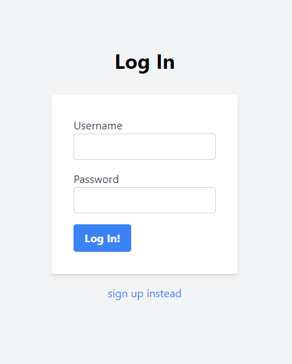
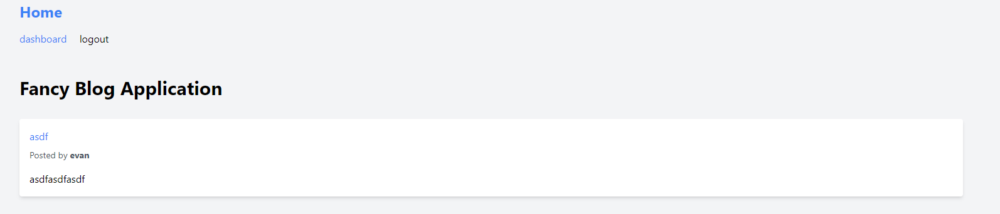
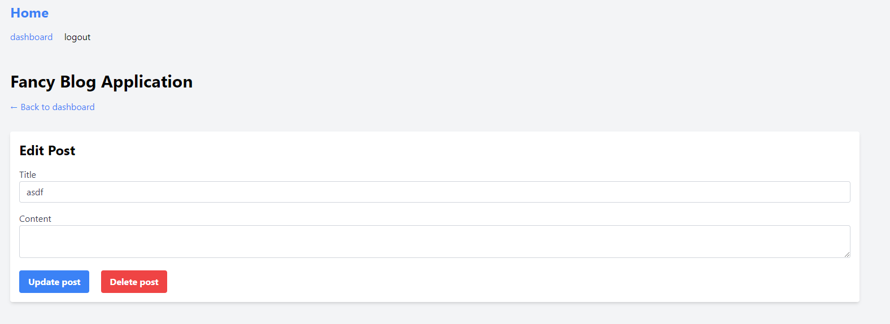

# MVC Blog Application

This is a simple MVC (Model-View-Controller) blog application built using PHP. The application allows users to perform CRUD operations on blog posts, manage user accounts, and interact with comments.

## Important Links
Live applications: https://mvc-blog-applications-2024-6092fe895613.herokuapp.com/

Repo link: https://github.com/Evan8383/mvc-blog-app

## Table of Contents

- [Features](#features)
- [Technologies Used](#technologies-used)
- [Usage](#usage)
- [Contributing](#contributing)
- [License](#license)

## Features

- User Authentication: Users can sign up, log in, and log out securely.
- CRUD Operations: Create, read, update, and delete blog posts.
- Commenting System: Users can engage with blog posts by leaving comments.
- Responsive Design: The application is optimized for various screen sizes.

## Technologies Used

- MySQL: Relational database management system for data storage.
- HTML: Markup language for creating web pages.
- CSS: Stylesheet language for designing the presentation of web pages.
- JavaScript: Programming language for enhancing user interactions.

## Usage
Register for a new account or log in if you already have one.
Create, read, update, or delete your blog posts.
Interact with other users' blog posts by leaving comments.
Log out when you're done.
Contributing
Contributions are welcome! If you have any suggestions, bug reports, or feature requests, please open an issue or create a pull request.

## License
This project is licensed under the MIT License.